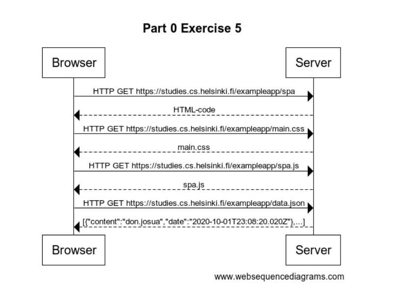

# Single page app

## Assignment

Create a diagram depicting the situation where the user goes to the [single page app](https://fullstackopen.com/en/part0/fundamentals_of_web_apps#single-page-app) version of the [notes app](https://studies.cs.helsinki.fi/exampleapp/spa).

---

## Solution



Solution Code:

```
    title Part 0 Exercise 5

    Browser->Server: HTTP GET https://studies.cs.helsinki.fi/exampleapp/spa
    Server-->Browser: HTML-code
    Browser->Server: HTTP GET https://studies.cs.helsinki.fi/exampleapp/main.css
    Server-->Browser: main.css
    Browser->Server: HTTP GET https://studies.cs.helsinki.fi/exampleapp/spa.js
    Server-->Browser: spa.js
    Browser->Server: HTTP GET https://studies.cs.helsinki.fi/exampleapp/data.json
    Server-->Browser: [{"content":"don.josua","date":"2020-10-01T23:08:20.020Z"},...]
```
