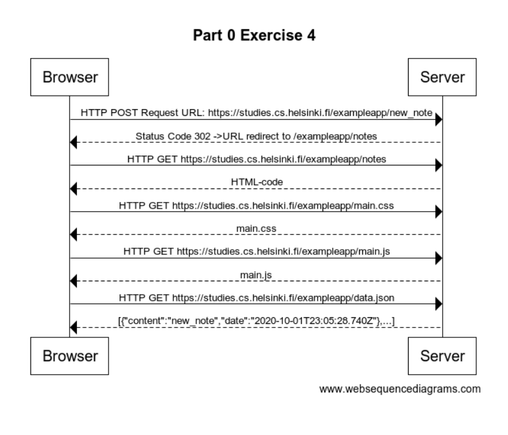

# New Note

## Assignment

**Create a similar diagram** depicting the situation where the user creates a new note on [page](https://studies.cs.helsinki.fi/exampleapp/notes) by writing something into the text field and clicking the `submit` button.

If necessary, show operations on the browser or on the server as comments on the diagram.

The diagram does not have to be a sequence diagram. Any sensible way of presenting the events is fine.

All necessary information for doing this, and the next two exercises, can be found from the text of [this part](https://fullstackopen.com/en/part0/fundamentals_of_web_apps#forms-and-http-post). The idea of these exercises is to read the text through once more, and to think through what is going on there. Reading the application [code](https://github.com/mluukkai/example_app) is not necessary, but it is of course possible.

---

## Solution



Solution Code:

```
    title Part 0 Exercise 4

    Browser->Server: HTTP POST Request URL: https://studies.cs.helsinki.fi/exampleapp/new_note
    Server-->Browser: Status Code 302 ->URL redirect to /exampleapp/notes
    Browser->Server: HTTP GET https://studies.cs.helsinki.fi/exampleapp/notes
    Server-->Browser: HTML-code
    Browser->Server: HTTP GET https://studies.cs.helsinki.fi/exampleapp/main.css
    Server-->Browser: main.css
    Browser->Server: HTTP GET https://studies.cs.helsinki.fi/exampleapp/main.js
    Server-->Browser: main.js
    Browser->Server: HTTP GET https://studies.cs.helsinki.fi/exampleapp/data.json
    Server-->Browser: [{"content":"new_note","date":"2020-10-01T23:05:28.740Z"},...]
```
