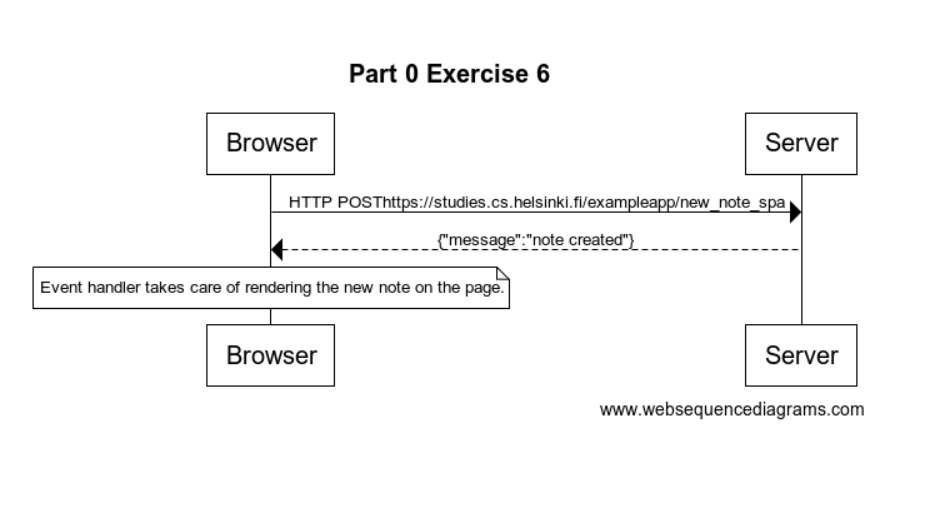

# New note

Create a diagram depicting the situation where user creates a new note using the single page version of the app.

This was the last exercise, and it's time to push your answers to GitHub and mark the exercises as done in the [submission application](https://studies.cs.helsinki.fi/stats/courses/fullstackopen).

---

## Solution



Solution Code:

```
    title Part 0 Exercise 6

    Browser->Server: HTTP POSThttps://studies.cs.helsinki.fi/exampleapp/new_note_spa
    Server-->Browser: {"message":"note created"}

    note over Browser
    Event handler takes care of rendering the new note on the page.
    end note
```
